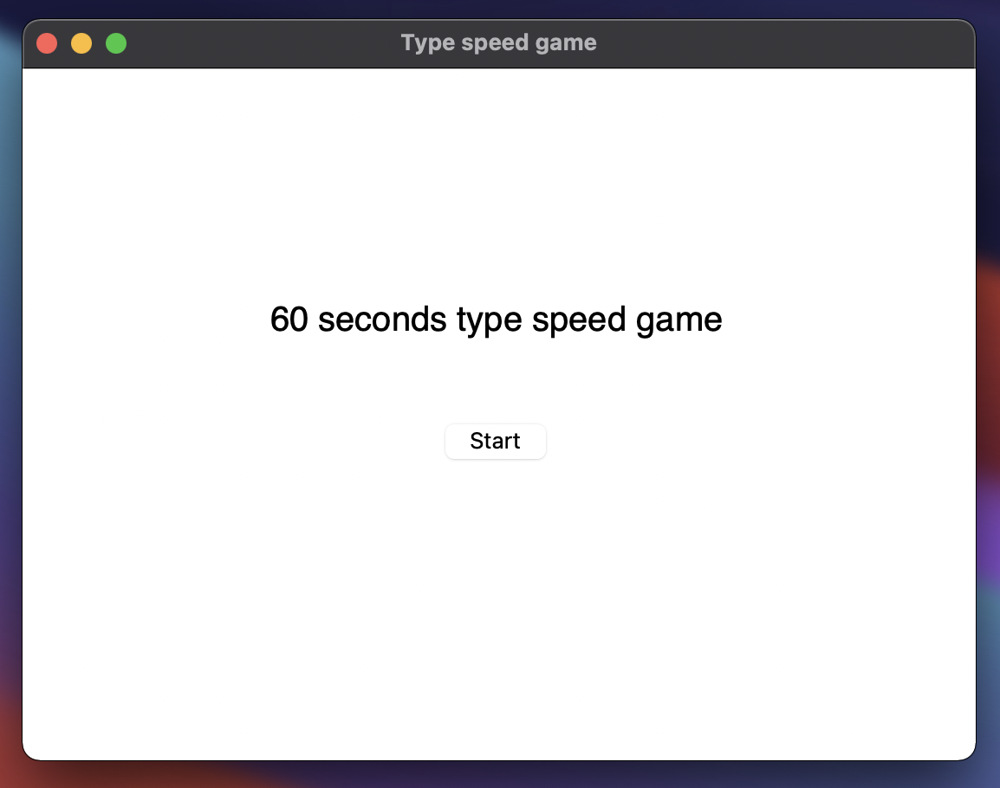
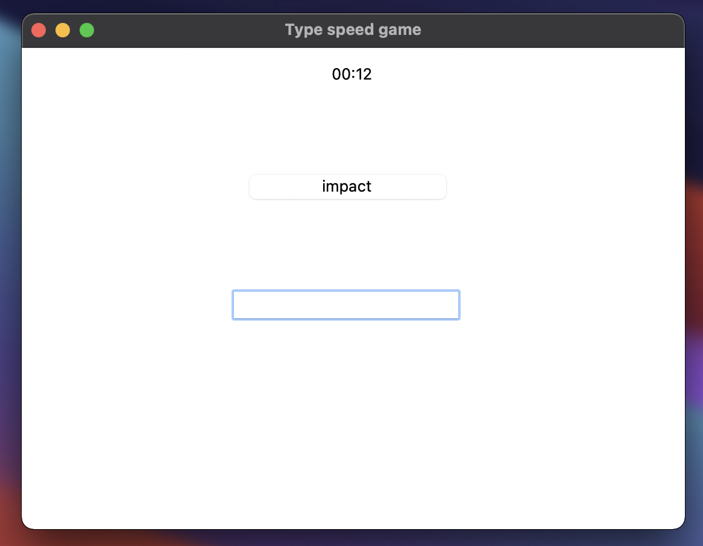
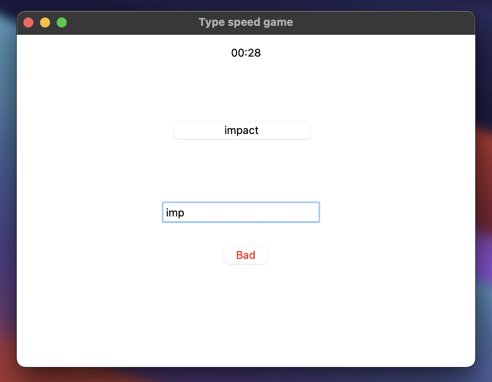
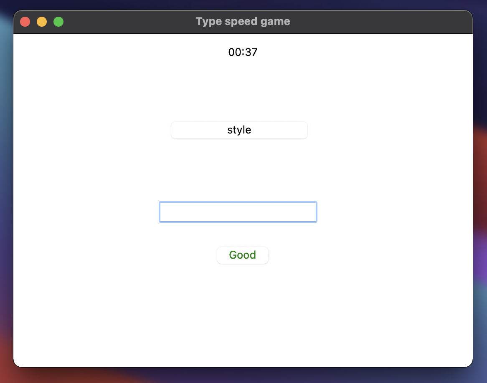
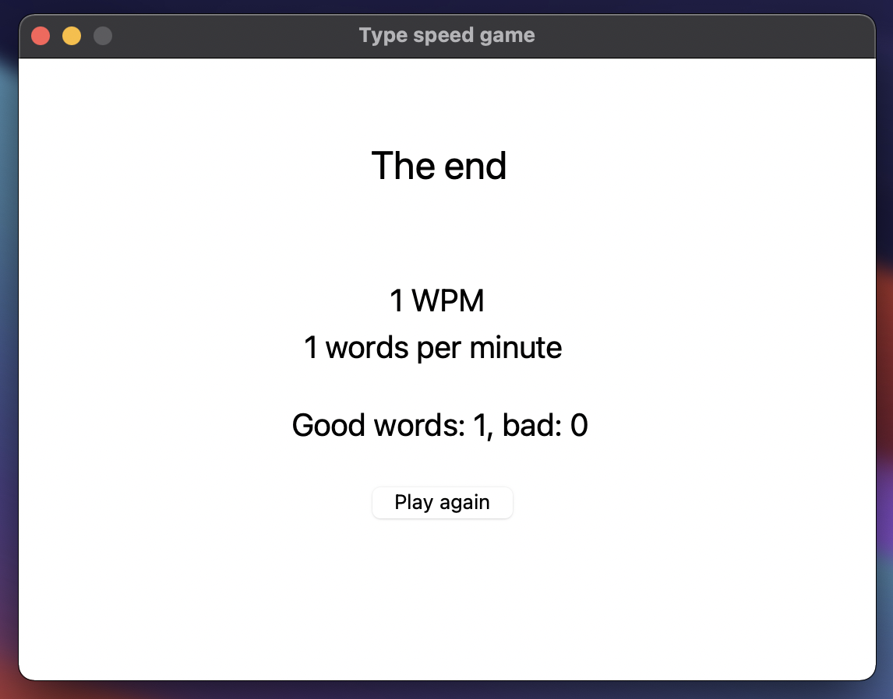

# Type speed game with Python with GUI using tkinter built-in module
> Check your Words Per Minute speed with this app-game.

## Table of Contents
* [General Info](#general-information)
* [Technologies Used](#technologies-used)
* [Screenshots](#screenshots)
* [Contact](#contact)
<!-- * [License](#license) -->

## General Information
- This app allows you to check your WPM (words per minute) score and tell you how many words you typed correctly and how many not in 60 seconds time
- App has the base of 218 most common English words, randomly generated to type them

## Technologies Used
- Python 3.x
- tkinter built-in Python module

## Screenshots

<!-- If you have screenshots you'd like to share, include them here. -->

## Contact
Mail: michvlbbb@gmail.com

<!-- Optional -->
<!-- ## License -->
<!-- This project is open source and available under the [... License](). -->

<!-- You don't have to include all sections - just the one's relevant to your project -->
